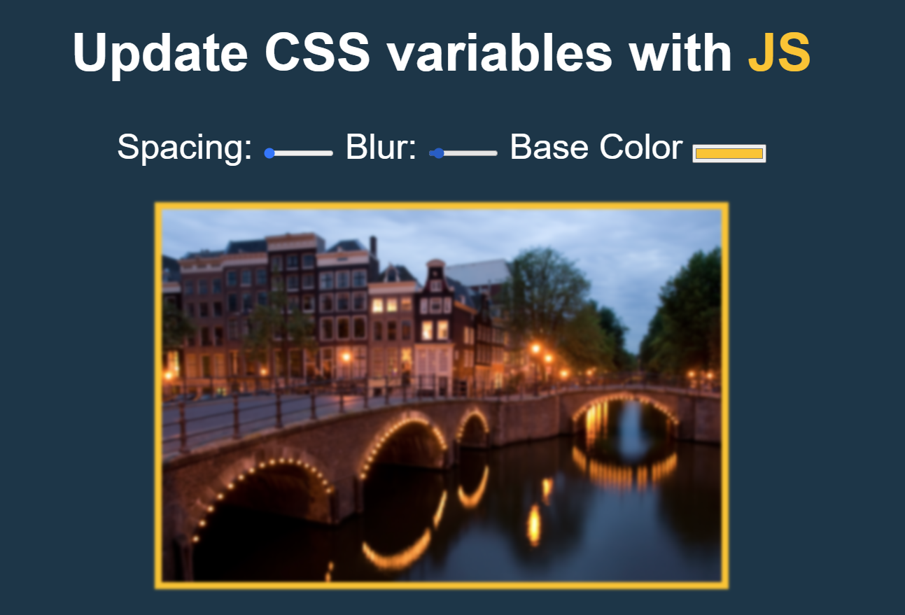

# Play with CSS variables
## Description: 
The page allows to change values of CSS variables with the user's input and shows the outcome immediately. 

## The outcome: 

## The Stack: 
The page built with **HTML, CSS and JavaScript**.

## The version: 
Completed

## The online demo: 
[**DEMO**](https://vladimir-bogomolov.github.io/CSSvars-JS/)

